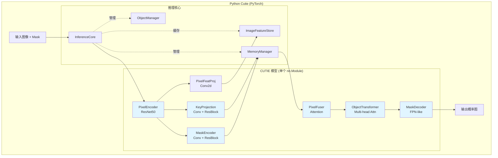
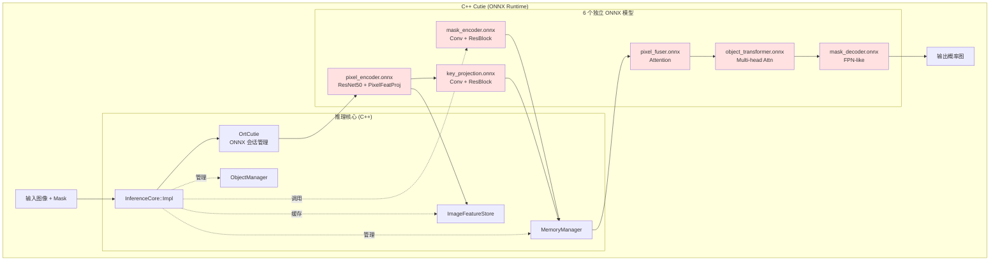
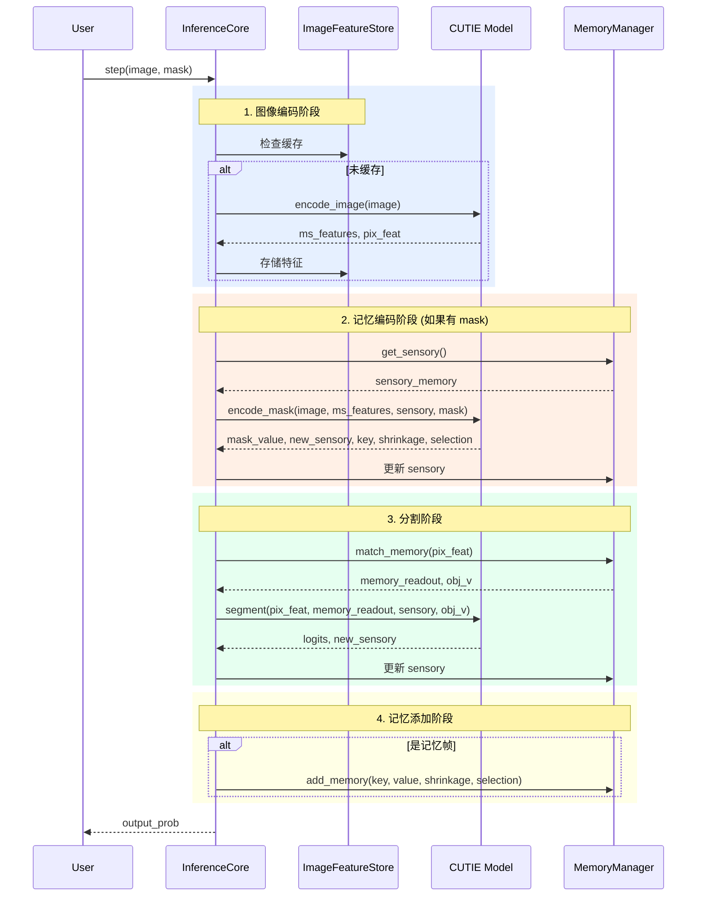
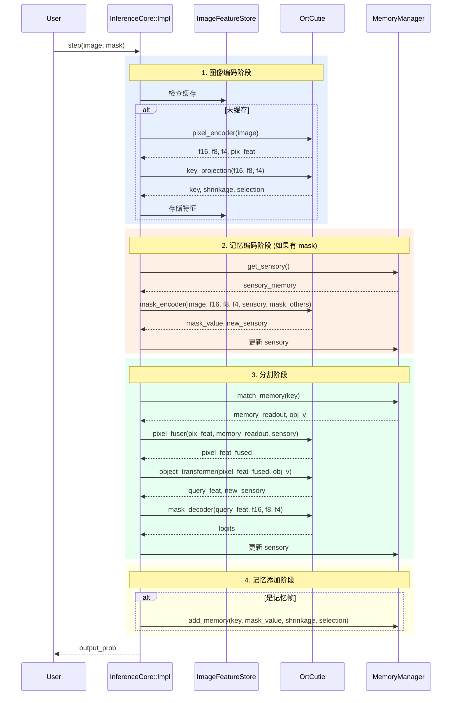
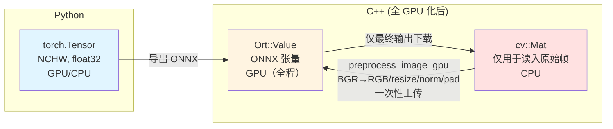
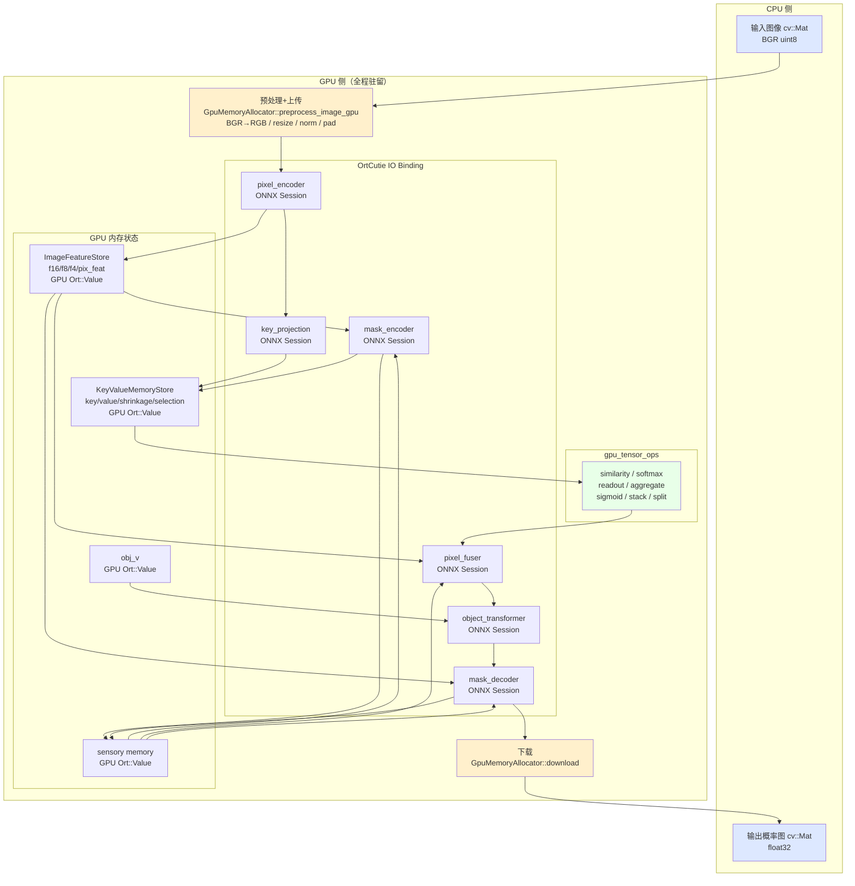

# Cutie 推理流程对比：Python vs C++

本文档对比分析原始 Cutie（Python/PyTorch）和 cutie-cpp（C++/ONNX Runtime）的推理架构差异。

## 整体架构对比

### Python 版本（单体模型）

### C++ 版本（拆分为 6 个 ONNX 子模块）

## 单帧推理流程对比

### Python 版本流程

### C++ 版本流程

## 关键差异总结

### 1. 模型组织方式

| 方面 | Python 版本 | C++ 版本 |
|------|------------|----------|
| **模型结构** | 单个 `CUTIE` nn.Module | 6 个独立 ONNX 文件 |
| **前向传播** | 方法调用（`encode_image()`, `segment()` 等） | ONNX Runtime 推理（`Ort::Session::Run()`） |
| **子模块通信** | 直接传递 PyTorch Tensor | 通过 `cv::Mat` 或 `Ort::Value` 传递 |
| **内存管理** | PyTorch 自动管理 GPU 内存 | 手动管理 `cv::Mat` 和 CUDA 内存 |

### 2. 推理流程差异

#### Python 版本特点：
- **一体化调用**：`network.segment()` 内部顺序调用 `pixel_fuser` → `object_transformer` → `mask_decoder`
- **灵活性高**：可以动态修改网络结构、添加调试输出
- **自动微分**：保留计算图用于训练（推理时关闭）

#### C++ 版本特点：
- **显式调用链**：必须手动按顺序调用 6 个 ONNX 模型
- **固定拓扑**：ONNX 导出时已固化网络结构
- **无计算图**：纯推理模式，无梯度信息
- **全 GPU 数据流**：输入图像上传 GPU 后，所有中间特征和内存状态保持在 GPU，仅最终输出下载至 CPU

### 3. 内存系统实现

两个版本的内存系统逻辑相同，但实现细节不同：

| 组件 | Python 实现 | C++ 实现 |
|------|------------|----------|
| **工作内存** | `KeyValueMemoryStore` (dict of Tensors) | `KeyValueMemoryStore` (GPU Ort::Value) |
| **长期内存** | 可选，基于原型压缩 | 同 Python，但用 C++ 容器 |
| **感知内存** | `dict[obj_id] -> Tensor` | GPU `Ort::Value`（全 GPU 化） |
| **对象管理** | `ObjectManager` (Python class) | `ObjectManager` (C++ class) |

### 4. 数据流转换

### 5. 性能考量

#### Python 版本：
- ✅ 开发效率高，易于调试
- ✅ 可以利用 PyTorch 的优化（算子融合、内存池）
- ❌ Python 解释器开销
- ❌ 需要完整 PyTorch 运行时（~2GB）

#### C++ 版本：
- ✅ 无 Python 依赖，部署轻量
- ✅ 更低的启动延迟
- ✅ 全 GPU 数据流：子模块间零 CPU↔GPU 往返拷贝（IO Binding + gpu_tensor_ops）
- ❌ 无法利用跨子模块的算子融合优化

## 潜在问题分析

### 1. 数据拷贝开销

~~C++ 版本在每个子模块调用时可能涉及：~~
~~`GPU → CPU (Ort::Value → cv::Mat) → GPU (cv::Mat → Ort::Value)`~~

**已解决**：通过 IO Binding + `gpu_tensor_ops` 模块，子模块间的中间张量全部驻留 GPU，仅输入图像上传和最终 logits 下载各发生一次 CPU↔GPU 传输。

### 2. 子模块边界固化

ONNX 导出时必须明确定义输入/输出，导致：
- 无法动态调整 `chunk_size`（必须在导出时固定）
- 难以支持可变数量的对象（需要动态 batch）

### 3. 内存管理复杂度

C++ 版本需要手动管理：
- GPU `Ort::Value` 的生命周期（由 `GpuMemoryAllocator` 统一管理）
- ONNX Runtime 的内存分配器
- CUDA 内存的同步

### 4. 调试困难

- Python 版本可以在任意位置插入 `print(tensor.shape)`
- C++ 版本需要将 GPU `Ort::Value` 下载至 CPU 才能检查数值

## 建议改进方向

1. **数值对齐测试**：
   - 实现与 Python 版本的逐层数值对比测试
   - 验证 GPU kernel 精度

2. **简化调试**：
   - 添加 `dump_tensor()` 工具函数（GPU → CPU 下载并打印）

3. **性能基准测试**：
   - 对比 Python vs C++ 的端到端延迟
   - 分析每个子模块的耗时占比

4. **考虑模型融合**：
   - 将部分子模块合并（如 `pixel_fuser` + `object_transformer`）
   - 减少子模块调用次数

---

**生成时间**: 2026-04-12  
**版本**: cutie-cpp v0.3.0（输入预处理 GPU 化完成）

---

## GPU 改造进度

### 阶段1：GPU 内存管理基础设施（已完成）

当前 C++ 版本的主要性能瓶颈在于子模块间的数据拷贝：每次调用 ONNX 子模块后，中间张量需要从 GPU 拷贝回 CPU（`Ort::Value → cv::Mat`），下一个子模块调用前再从 CPU 上传到 GPU（`cv::Mat → Ort::Value`）。阶段1完成了消除这一往返拷贝所需的基础组件。

**已完成内容：**

| 组件 | 文件 | 说明 |
|------|------|------|
| GPU 内存分配器 | `include/cutie/ort/core/gpu_memory.h` + `src/ort/core/gpu_memory.cpp` | `GpuMemoryAllocator` 类，封装 CUDA 内存分配/释放、CPU↔GPU 传输、`GpuMat↔Ort::Value` 零拷贝绑定 |
| CUDA kernel 声明 | `include/cutie/ort/core/cuda_kernels.h` | 12 个张量操作 kernel 的函数签名 |
| CUDA kernel 实现 | `src/ort/core/cuda_kernels.cu` | concat、slice、sigmoid、aggregate_softmax、get_similarity、top_k_softmax、one_hot、mask_merge、fill_zero、copy_d2d、add_inplace、bilinear_resize |
| 构建系统 | `CMakeLists.txt` | 添加 CUDA 语言支持、cuBLAS 链接、GPU 架构配置（sm_75/80/86/89/90） |

### 阶段2：OrtCutie IO Binding 改造（已完成）

本阶段将 `OrtCutie` 类从标准 `Session::Run()` 模式全面改造为 ONNX Runtime IO Binding 模式，实现所有子模块的输入输出张量直接绑定 GPU 内存，彻底消除子模块边界处的 CPU↔GPU 往返拷贝。

**已完成内容：**

- `OrtCutie` 持有 `GpuMemoryAllocator` 替代原来的 CPU `MemoryInfo`，强制要求 CUDA 设备
- `run_session()` 内部改为使用 `Ort::IoBinding` API，输入输出均绑定至 GPU 内存地址
- 6 个子模块方法（`pixel_encoder`、`key_projection`、`mask_encoder`、`pixel_fuser`、`object_transformer`、`mask_decoder`）的接口统一改为接收和返回 GPU `Ort::Value`（即 `GpuMat` 绑定的张量）
- `pad`/`slice` 等预处理操作切换为 GPU CUDA kernel 版本，避免 CPU 端中转
- 移除所有 `clone_tensor()` CPU 拷贝调用

### 步骤1：gpu_tensor_ops 模块（已完成）

本步骤新增 `src/ort/core/gpu_tensor_ops.cpp` 模块，将原本在 CPU 上执行的张量操作原语全部迁移至 GPU，为后续各层 GPU 化提供统一的 GPU 算子支持。

**已完成内容：**

- 实现 GPU 上的相似度计算（`get_similarity`）、softmax（`top_k_softmax`）、记忆读出（`readout`）、特征聚合（`aggregate`）等算子
- 实现 sigmoid、张量 stack/split 等辅助操作，全部通过 CUDA kernel 或 cuBLAS 在 GPU 上完成
- 统一封装为 `gpu_tensor_ops` 命名空间，供 `KeyValueMemoryStore`、`MemoryManager` 等上层模块调用

### 步骤2：KeyValueMemoryStore GPU 化（已完成）

将 `KeyValueMemoryStore` 中所有存储从 `cv::Mat`（CPU）全面迁移为 GPU `Ort::Value`，记忆的读写、淘汰、拼接等操作均在 GPU 上完成。

**已完成内容：**

- `key`、`value`、`shrinkage`、`selection` 等所有 KV 缓冲区由 `cv::Mat` 改为 GPU `Ort::Value`
- `add_memory`、`consolidate`、`FIFO 淘汰` 等操作均调用 GPU kernel，不再产生 CPU 端拷贝

### 步骤3：MemoryManager GPU 化（已完成）

将 `MemoryManager` 及 `ImageFeatureStore` 中涉及感知记忆（sensory）、对象向量（obj_v）、记忆读出（readout）、记忆写入（add_memory）的全部操作迁移至 GPU。

**已完成内容：**

- `sensory memory`、`obj_v` 的存储与更新全部使用 GPU `Ort::Value`
- `match_memory`（记忆读出）调用 `gpu_tensor_ops::readout`，在 GPU 上完成 KV 匹配与加权聚合
- `add_memory` 写入路径无 CPU 中转

### 步骤4：InferenceCore GPU 数据流（已完成）

`InferenceCore` 主循环改造为全 GPU 数据流：输入图像在 CPU 预处理后一次性上传到 GPU，所有中间特征和内存状态保持在 GPU，仅最终 logits 在输出阶段下载回 CPU 生成概率图。

**已完成内容：**

- 输入图像（CPU `cv::Mat`）经预处理后通过 `GpuMemoryAllocator::upload` 上传至 GPU
- `pixel_encoder` 到 `mask_decoder` 的全部 6 个子模块输入输出均为 GPU `Ort::Value`，无 CPU 中转
- `ImageFeatureStore` 缓存的 `f16/f8/f4/pix_feat` 均为 GPU 张量
- 仅在输出阶段调用 `GpuMemoryAllocator::download`，将 logits 下载至 CPU 生成最终概率图

### 输入预处理 GPU 化（已完成）

本步骤将输入图像的全部预处理流程从 CPU 迁移至 GPU，彻底消除帧预处理阶段的 CPU 计算开销，实现从原始输入到推理结束的端到端全 GPU 流水线。

**已完成内容：**

- 新增 `GpuMemoryAllocator::preprocess_image_gpu()` 方法，在 GPU 上依次完成：BGR→RGB 通道转换（`cv::cuda::cvtColor`）、resize（`cv::cuda::resize`）、ImageNet 均值/方差归一化、pad 至模型输入尺寸（`cv::cuda::copyMakeBorder`）
- resize 目标尺寸从 ONNX `pixel_encoder` 模型参数自动读取（`model_h_` / `model_w_`），不再依赖 `CutieConfig::max_internal_size` 配置项
- `InferenceCore` 新增 `cached_image_gpu_` 成员缓存当前帧的 GPU 图像张量，在同一帧内多次调用子模块（`mask_encoder` 等）时直接复用，避免重复上传和重复预处理
- `ensure_features()` 和 `add_memory()` 接口不再接收 CPU `image_blob` 参数，图像数据由缓存的 GPU 张量提供

### 全 GPU 推理模块架构图

